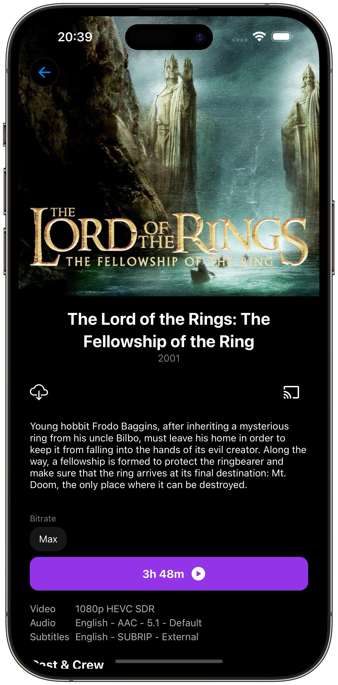
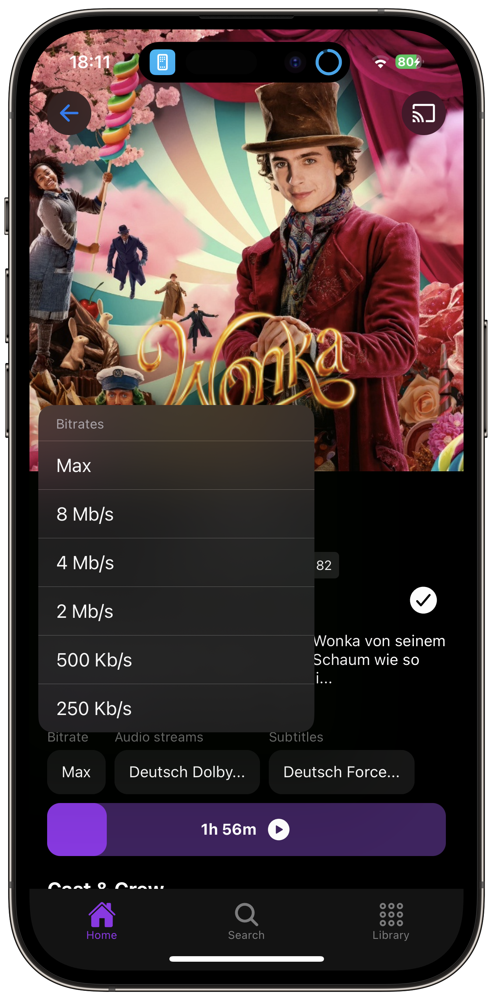
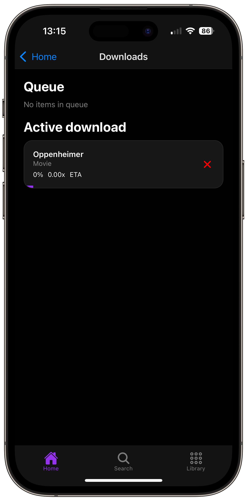
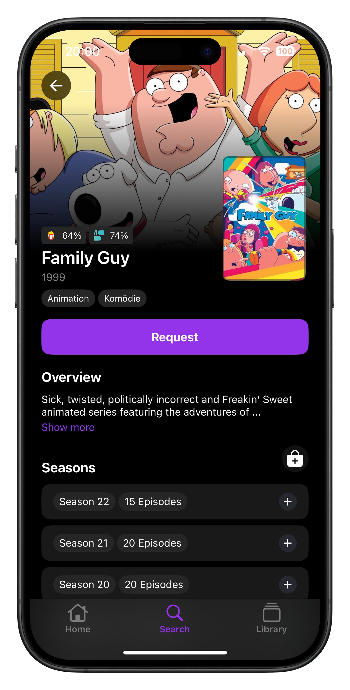

  

**Streamyfin is a user-friendly Jellyfin video streaming client built with Expo. Designed as an alternative to other Jellyfin clients, it aims to offer a smooth and reliable streaming experience. We hope you'll find it a valuable addition to your media streaming toolbox.**

---

  
  &nbsp;
  
  &nbsp;
  
  &nbsp;
  

## 🌟 Features

### 🎬 Media Playback
- 🚀 **Skip Intro / Credits**: Automatically skip intros and credits during playback
- 🖼️ **Trickplay Images**: Chapter previews with thumbnails when seeking
- 🎵 **Music Library**: Full support for music playback with playlists and queue management
- 📺 **Live TV**: Watch and record live television streams
- 📡 **Chromecast**: Cast your media to any Chromecast-enabled device
- 🎥 **MPV Player**: Powerful open-source player with wide format support

### 📱 Media Management
- 📥 **Download Media**: Save movies, shows, and music locally for offline viewing
- ⭐ **Favorites**: Quick access to your favorite content
- 📋 **Watchlists**: Create and manage custom watchlists with Streamystats integration
- 🔖 **Continue Watching**: Pick up right where you left off
- 🎯 **Next Up**: Smart suggestions for your next episode

### ⚙️ Advanced Features
- 🤖 **Seerr Integration**: Request new media directly in the app
- 🔍 **Smart Search**: Powerful search with Marlin Search and Streamystats support
- 👁️ **Active Sessions**: View all active streams on your server
- 🌐 **Multi-Language**: Available in 20+ languages with Crowdin integration
- 🎨 **Customizable**: Personalize your home screen and settings
- 🔌 **Plugin System**: Centralized settings sync across all devices via Jellyfin plugin

## 🧩 How It Works

### 📥 Downloads

Downloading works by using FFmpeg to convert an HLS stream into a video file on your device. This lets you download and watch any content that you can stream. The conversion is handled in real time by Jellyfin on the server during the download. While this may take a bit longer, it ensures compatibility with any file your server can transcode.

### 🧩 Streamyfin Plugin

The Jellyfin Plugin for Streamyfin synchronizes settings across all your devices and users. Install it on your Jellyfin server to enable:

- Automatic Seerr login with no user input required
- Default language preferences for audio and subtitles
- Configure download settings and search providers (Marlin, Streamystats)
- Customize your home screen layout and sections
- Centralized configuration management
- And much more

[Streamyfin Plugin](https://github.com/streamyfin/jellyfin-plugin-streamyfin)

### 🎬 MPV Player

Streamyfin uses [MPV](https://mpv.io/) as its primary video player on all platforms, powered by [MPVKit](https://github.com/mpvkit/MPVKit). MPV is a powerful, open-source media player known for its wide format support and high-quality playback.

Thanks to [@Alexk2309](https://github.com/Alexk2309) for the hard work building the native MPV module in Streamyfin.

### 🎵 Music Library

Full music library support with playlists, queue management, background playback, and offline downloads.

### 🔍 Search Providers

Streamyfin supports multiple search providers:

- **Marlin Search**: Fast semantic search for your Jellyfin library
- **Streamystats**: Advanced statistics and personalized recommendations
- **Jellysearch**: Fast full-text search proxy ([Jellysearch](https://gitlab.com/DomiStyle/jellysearch))

## 🛣️ Roadmap

Check out our [Roadmap](https://github.com/users/fredrikburmester/projects/5) to see what we're working on next. We are always open to feedback and suggestions. Please let us know if you have any ideas or feature requests.

## 📥 Download Streamyfin

  
  
  
  

### 🧪 Beta Testing

To access the Streamyfin beta, you need to subscribe to the Member tier (or higher) on [Patreon](https://www.patreon.com/streamyfin). This grants you immediate access to the ⁠🧪-beta-releases channel on Discord and lets me know you’ve subscribed. This is where I share APKs and IPAs. It does not provide automatic TestFlight access, so please send me a DM (Cagemaster) with the email you use for Apple so we can add you manually.

**Note**: Anyone actively contributing to Streamyfin’s source code will receive automatic access to beta releases.

## 🚀 Getting Started

### ⚙️ Prerequisites

- Your device is on the same network as the Jellyfin server (for local connections)  
- Your Jellyfin server is up and running with remote access enabled if you plan to connect from outside your local network  
- Your server version is up to date (older versions may cause compatibility issues)  
- You have a valid Jellyfin user account with access to the media libraries you want to view  
- If using features such as **downloads** or **Seerr integration**, confirm the required plugins are installed and configured on your Jellyfin server

## 🙌 Contributing

We welcome contributions that improve Streamyfin. Start by forking the repository and submitting a pull request. For major changes or new features, please open an issue first to discuss your ideas and ensure alignment with the project.

## 🌍 Translations

Streamyfin is available in multiple languages, and we’re always looking for contributors to help make the app accessible worldwide.  
You can contribute translations directly on our [Crowdin project page](https://crowdin.com/project/streamyfin).

### 👨‍💻 Development Info

1. Use Node.js `>20`
2. Install dependencies: `bun i && bun run submodule-reload`
3. Make sure you have Xcode and/or Android Studio installed ([Expo setup guide](https://docs.expo.dev/workflow/android-studio-emulator/))
   - If iOS builds fail with `missing Metal Toolchain` (KSPlayer shaders), run `npm run ios:install-metal-toolchain` once
4. Install the [BiomeJS extension](https://biomejs.dev/) in your IDE
5. Run `npm run prebuild`
6. Create an Expo dev build by running `npm run ios` or `npm run android`. This will open a simulator on your computer and run the app

For the TV version suffix the npm commands with `:tv`.

`npm run prebuild:tv`  
`npm run ios:tv or npm run android:tv`

## 👋 Get in Touch with Us

Need assistance or have any questions?

- **Discord:** [Join our server](https://discord.gg/BuGG9ZNhaE)
- **GitHub Issues:** [Report bugs or request features](https://github.com/streamyfin/streamyfin/issues)  
- **Email:** [developer@streamyfin.app](mailto:developer@streamyfin.app)  

## ❓ FAQ

1. **Q: Why can't I see my libraries in Streamyfin?**  
   A: Ensure your Jellyfin server is running a recent version (10.10.0+) and that you have proper permissions to access the libraries.

2. **Q: How do I enable downloads?**  
   A: Downloads use FFmpeg to convert HLS streams. Ensure your server has transcoding enabled and sufficient resources.

3. **Q: Does Streamyfin support subtitles?**  
   A: Yes, with full customization including size, color, position, and automatic language selection.

4. **Q: Can I use Streamyfin on Apple TV or Android TV?**  
   A: Yes, Streamyfin has dedicated TV builds optimized for remote control navigation. Please note that TV platforms are currently in early development and not very stable. Android TV is currently the most reliable platform for testing.

5. **Q: How do I set up Seerr integration?**  
   A: Go to Settings → Plugins → Seerr, enter your server URL and Jellyfin credentials.

## 📝 Credits

Streamyfin is developed by [Fredrik Burmester](https://github.com/fredrikburmester) and is not affiliated with Jellyfin. The app is built using Expo, React Native, and other open-source libraries.

## 🎖️ Core Developers

Thanks to the following contributors for their significant contributions:

<table>
  <tr>
    <td align="center">
      <a href="https://github.com/Alexk2309">
        
         <b>@Alexk2309</b>
      </a>
    </td>
    <td align="center">
      <a href="https://github.com/herrrta">
        
         <b>@herrrta</b>
      </a>
    </td>
    <td align="center">
      <a href="https://github.com/lostb1t">
        
         <b>@lostb1t</b>
      </a>
    </td>
    <td align="center">
      <a href="https://github.com/Simon-Eklundh">
        
         <b>@Simon-Eklundh</b>
      </a>
    </td>
    <td align="center">
      <a href="https://github.com/topiga">
        
         <b>@topiga</b>
      </a>
    </td>
    <td align="center">
      <a href="https://github.com/lancechant">
        
         <b>@lancechant</b>
      </a>
    </td>
  </tr>
  <tr>
    <td align="center">
      <a href="https://github.com/simoncaron">
        
         <b>@simoncaron</b>
      </a>
    </td>
    <td align="center">
      <a href="https://github.com/jakequade">
        
         <b>@jakequade</b>
      </a>
    </td>
    <td align="center">
      <a href="https://github.com/Ryan0204">
        
         <b>@Ryan0204</b>
      </a>
    </td>
    <td align="center">
      <a href="https://github.com/retardgerman">
        
         <b>@retardgerman</b>
      </a>
    </td>
    <td align="center">
      <a href="https://github.com/whoopsi-daisy">
        
         <b>@whoopsi-daisy</b>
      </a>
    </td>
    <td align="center">
      <a href="https://github.com/Gauvino">
        
         <b>@Gauvino</b>
      </a>
    </td>
  </tr>
</table>

## ✨ Acknowledgements

We would like to thank the Jellyfin team for their excellent software and support on Discord.

Special thanks to the official Jellyfin clients, which have served as an inspiration for Streamyfin.

We also thank all other developers who have contributed to Streamyfin, your efforts are greatly appreciated.

A special mention to the following people and projects for their contributions:

- [@Alexk2309](https://github.com/Alexk2309) for building the native MPV module that integrates [MPVKit](https://github.com/mpvkit/MPVKit) with React Native
- [Reiverr](https://github.com/aleksilassila/reiverr) for invaluable help with understanding the Jellyfin API
- [Jellyfin TS SDK](https://github.com/jellyfin/jellyfin-sdk-typescript) for providing the TypeScript SDK
- [Seerr](https://github.com/seerr-team/seerr) for enabling API integration with their project

## ⭐ Star History

## 📄 License

Streamyfin is licensed under the Mozilla Public License 2.0 (MPL-2.0).

This means you are free to use, modify, and distribute this software. The MPL-2.0 is a copyleft license that allows for more flexibility in combining the software with proprietary code.

Key points of the MPL-2.0:

- You can use the software for any purpose
- You can modify the software and distribute modified versions
- You must include the original copyright and license notices
- You must disclose your source code for any modifications to the covered files
- Larger works may combine MPL code with code under other licenses
- MPL-licensed components must remain under the MPL, but the larger work can be under a different license

For the full text of the license, please see the LICENSE file in this repository.

## ⚠️ Disclaimer

Streamyfin does not promote, support, or condone piracy in any form. The app is intended solely for streaming media that you personally own and control. It does not provide or include any media content. Any discussions, support requests, or references to piracy, as well as any tools, software, or websites related to piracy, are strictly prohibited across all our channels.

## 🤝 Sponsorship

VPS hosting generously provided by [Hexabyte](https://hexabyte.se/en/vps/?currency=eur) and [SweHosting](https://swehosting.se/en/#tj%C3%A4nster).
